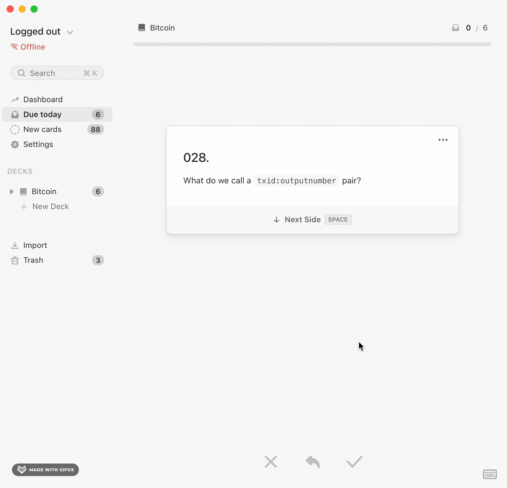

# Bitcoin Cards
This is a collection of flashcards I built for myself over time and I think can be useful to other people.

    

I use a script to build each deck of 100 cards into a zip file that can be imported into [Mochi](https://mochi.cards/)—my preferred spaced repetition learning software—but you could import them into [Anki](https://apps.ankiweb.net/) as well.

See the [release page](https://github.com/thunderbiscuit/bitcoin-cards/releases) and try them out!

I'm testing these cards myself as I go so they'll get updates as I find better ways to word the questions and answers. Feel free to open issues and PRs if you see anything that could be improved.

## Versioning
| Deck | Version | Tarball |
|:-----|:---:|---:|
| `deck1-btc-dev` | `0.1.0` | `deck1-btc-dev-v010` |
| `deck2-ln-dev` | 🏗️ | not yet released |
